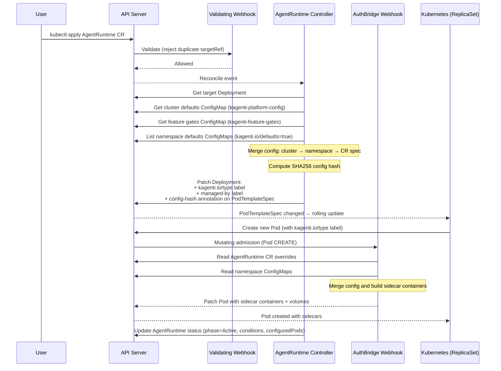
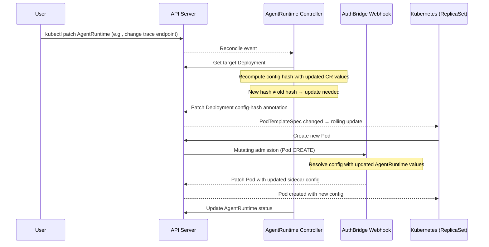
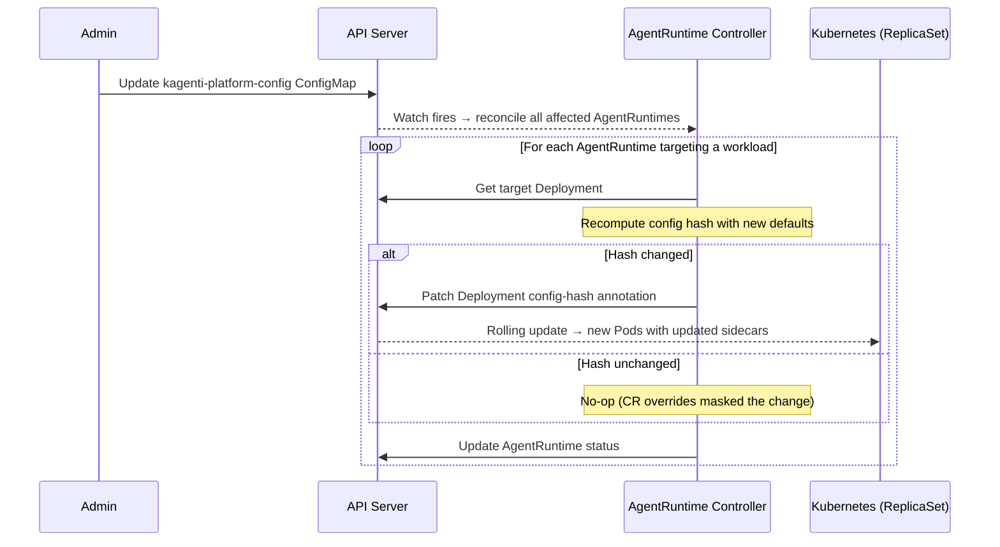
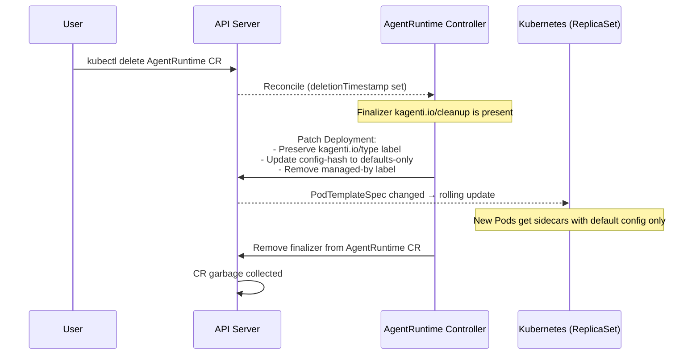

# Controller-Webhook Interaction

This document describes how the AgentRuntime controller and AuthBridge mutating webhook coordinate to configure and inject sidecars into agent and tool workloads. Both components run in the same operator binary.

## Two-Phase Model

The AgentRuntime system uses a two-phase model:

1. **Controller phase**: The AgentRuntime controller watches CRs and applies labels + a config-hash annotation to the target workload's PodTemplateSpec. This triggers a Kubernetes rolling update.
2. **Webhook phase**: The AuthBridge mutating webhook intercepts Pod CREATE requests. When a Pod has the `kagenti.io/type` label (applied by the controller), the webhook injects sidecar containers.

The controller never mutates Pods directly. The webhook does not decide *which labels to apply* — that is encoded by the controller. However, the webhook does require a matching AgentRuntime CR to exist as a gate before injecting sidecars, and reads the CR for per-workload configuration overrides.

## Sequence Diagrams

### AgentRuntime CR Create



### AgentRuntime CR Update (Config Change)



### ConfigMap Change (Cluster or Namespace Defaults)



### AgentRuntime CR Delete



## Responsibility Split

| Concern | Controller | Webhook |
|---------|-----------|---------|
| Detect config change | Yes (3-layer merge + hash) | No |
| Trigger pod restart | Yes (annotation on PodTemplateSpec) | No |
| Read ConfigMap data | Yes (for hash computation) | Yes (for sidecar configuration) |
| Merge config values | Yes (same 3-layer merge) | Yes (independently, same algorithm) |
| Mutate pod spec | No | Yes (sidecar injection) |
| Read AgentRuntime CR | Yes (primary resource) | Yes (for per-workload overrides) |
| Apply workload labels | Yes | No |
| Decide injection eligibility | No (encodes in labels) | Yes (objectSelector + precedence chain) |

## 3-Layer Configuration Merge

Both the controller and webhook perform the same 3-layer configuration merge independently:

```
┌──────────────────────────────────────┐
│ Layer 3: AgentRuntime CR overrides   │  ← highest precedence
│   (spec.identity, spec.trace)        │
├──────────────────────────────────────┤
│ Layer 2: Namespace defaults          │
│   (ConfigMap with                    │
│    kagenti.io/defaults=true label)   │
├──────────────────────────────────────┤
│ Layer 1: Cluster defaults            │  ← lowest precedence
│   (kagenti-platform-config in        │
│    kagenti-system namespace)         │
└──────────────────────────────────────┘
```

**Feature gates** (`kagenti-feature-gates` ConfigMap) are platform-wide policy and are **not** part of the merge hierarchy. They control which sidecar components are enabled globally and cannot be overridden by namespace defaults or AgentRuntime CRs.

The controller uses the merged config to compute a deterministic SHA256 hash. This hash is set as the `kagenti.io/config-hash` annotation on the workload's PodTemplateSpec. When any layer changes, the hash changes, which triggers a Kubernetes rolling update.

The webhook performs the same merge at Pod CREATE time to resolve the actual configuration values used for sidecar container environment variables.

> **Note:** The controller and webhook use slightly different sources for layer 1. The controller reads the `kagenti-platform-config` ConfigMap from `kagenti-system` via the API server. The webhook uses compiled defaults overlaid with `/etc/kagenti/config.yaml` (PlatformConfig), which is designed to carry equivalent values. Both produce the same effective defaults in a correctly deployed cluster.

## Global and Cluster Configuration

When workloads are deployed with the right labels (`kagenti.io/type: agent` or `tool`), the webhook uses two levels of global configuration regardless of whether an AgentRuntime CR exists:

### PlatformConfig (Global Defaults)

The webhook loads **PlatformConfig** at startup from compiled defaults overlaid with `/etc/kagenti/config.yaml`. This provides:

- Sidecar container images and resource requests/limits
- Proxy ports and UID
- Token exchange defaults (token URL, audience, scopes)
- SPIFFE trust domain and socket path
- Observability settings (trace endpoint, protocol, sampling)

PlatformConfig is hot-reloaded via fsnotify when the config file changes. It forms **layer 1** (lowest precedence) of the 3-layer merge.

### Feature Gates (Global Policy)

Feature gates are loaded from the `kagenti-feature-gates` ConfigMap (mounted at `/etc/kagenti/feature-gates/feature-gates.yaml`) and hot-reloaded. They act as cluster-wide kill switches:

| Gate | Default | Effect |
|------|---------|--------|
| `globalEnabled` | `true` | Master kill switch — `false` disables all injection |
| `envoyProxy` | `true` | Enable/disable envoy-proxy + proxy-init |
| `spiffeHelper` | `true` | Enable/disable spiffe-helper |
| `clientRegistration` | `true` | Enable/disable client-registration |
| `injectTools` | `false` | Allow injection for `kagenti.io/type=tool` workloads |
| `perWorkloadConfigResolution` | `false` | Switch from ValueFrom refs to literal env var injection |

Feature gates are **not** part of the 3-layer merge — they cannot be overridden by namespace defaults or AgentRuntime CRs.

### Config Resolution Modes

When `perWorkloadConfigResolution` is **false** (default), the webhook builds sidecar containers with `ValueFrom` ConfigMapKeyRef/SecretKeyRef references. Kubelet resolves these at container start time from namespace ConfigMaps. This means workloads pick up namespace ConfigMap changes on next pod restart without needing a config hash change.

When `perWorkloadConfigResolution` is **true**, the webhook resolves all config values at admission time by reading namespace ConfigMaps and AgentRuntime CR overrides, then injects literal environment variable values into the sidecar containers.

## Defaults-Only Path (No AgentRuntime CR)

When a workload has `kagenti.io/type` labels applied manually (without an AgentRuntime CR):

- The webhook still evaluates the workload for injection using PlatformConfig and feature gates
- The AgentRuntime override layer (layer 3) is skipped — configuration comes from PlatformConfig (layer 1) and namespace ConfigMaps (layer 2) only
- No controller manages the config hash — configuration drift is not detected automatically, and changes to cluster/namespace defaults do not trigger rolling updates
- The controller does not watch or reconcile these workloads
- Per-workload identity (SPIFFE trust domain) and trace overrides are not available

The AgentRuntime CR is the recommended approach because it provides:
- Automatic rolling updates on config change (any layer)
- Per-workload identity and trace overrides
- Status reporting (phase, conditions, configured pod count)
- Graceful cleanup via finalizer

## Related Documentation

- [API Reference](api-reference.md) — AgentRuntime and AgentCard CRD specifications
- [AuthBridge Webhook Design](authbridge-webhook.md) — Sidecar injection precedence chain and configuration merge
- [Architecture](architecture.md) — Overall operator architecture
